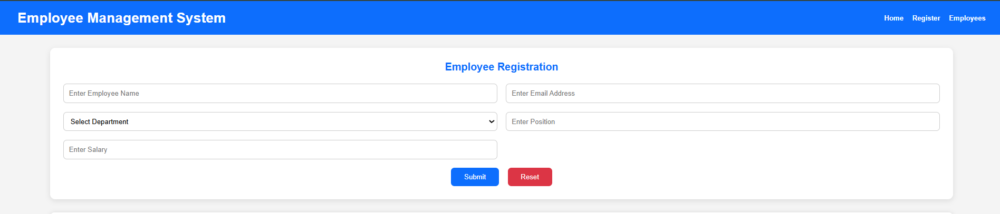
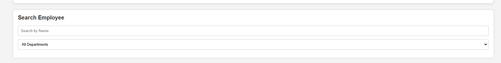
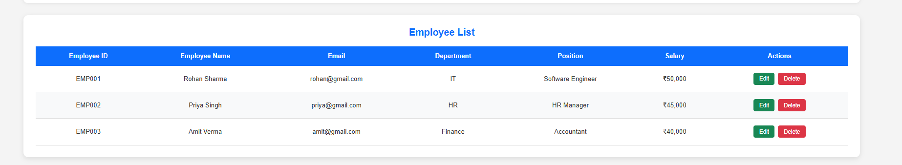
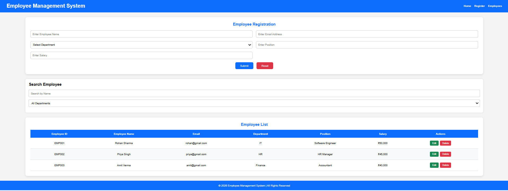
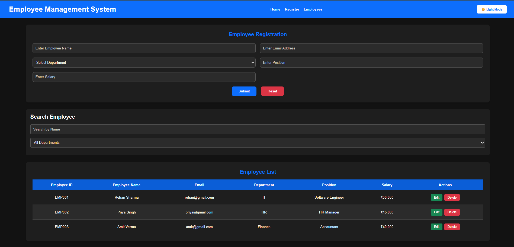
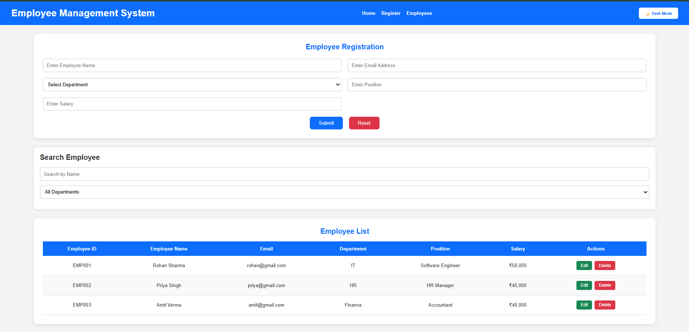
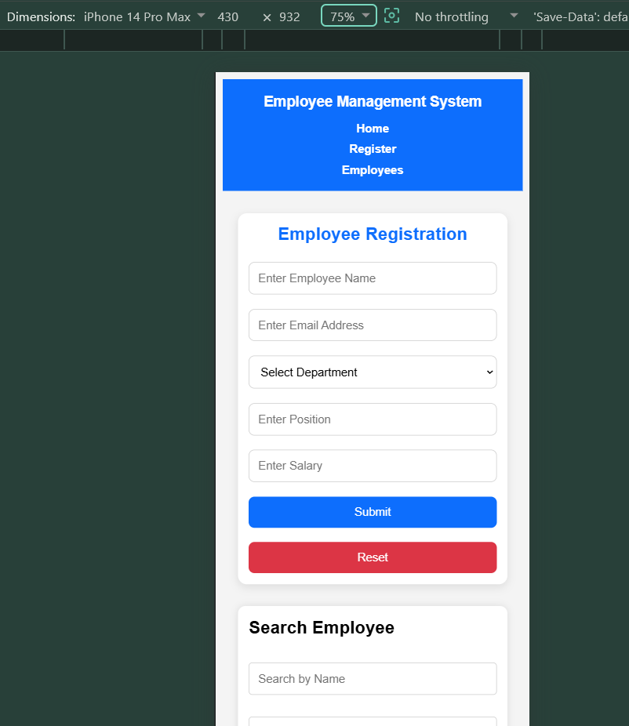
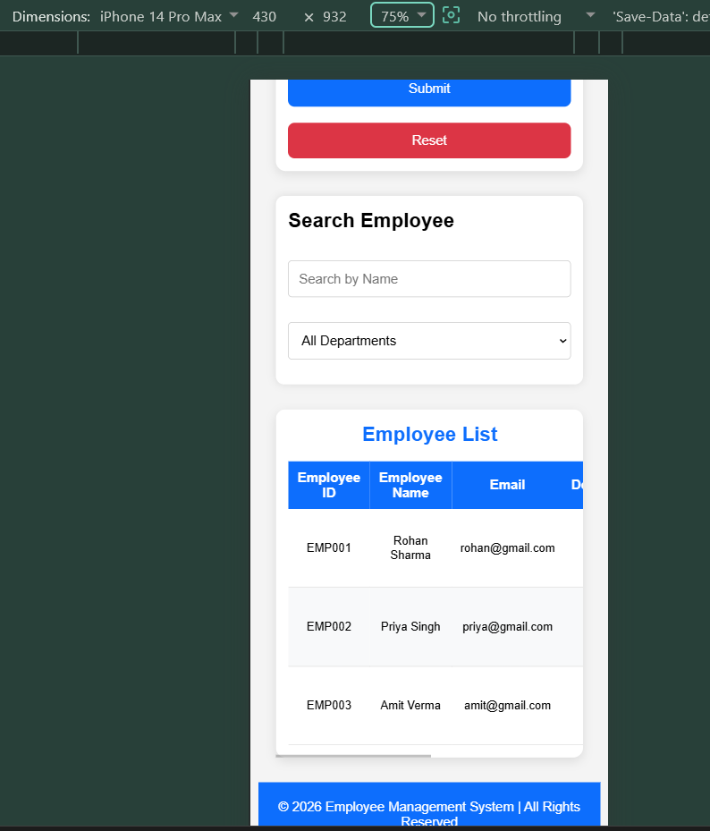
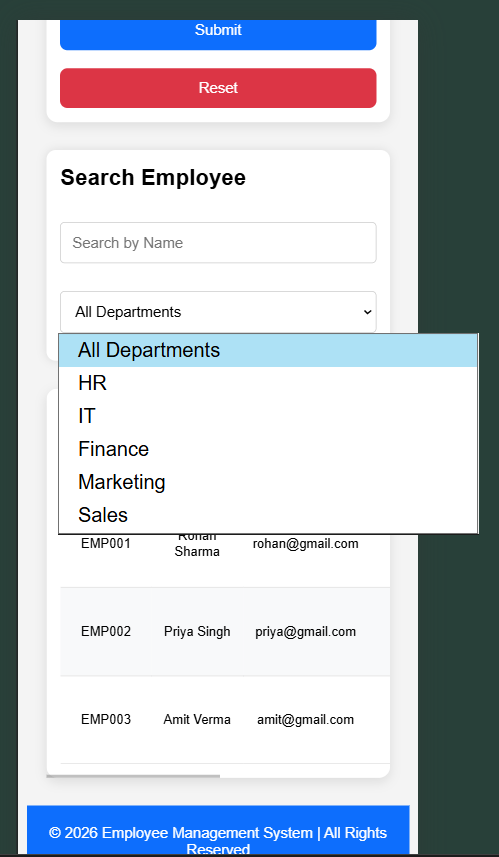
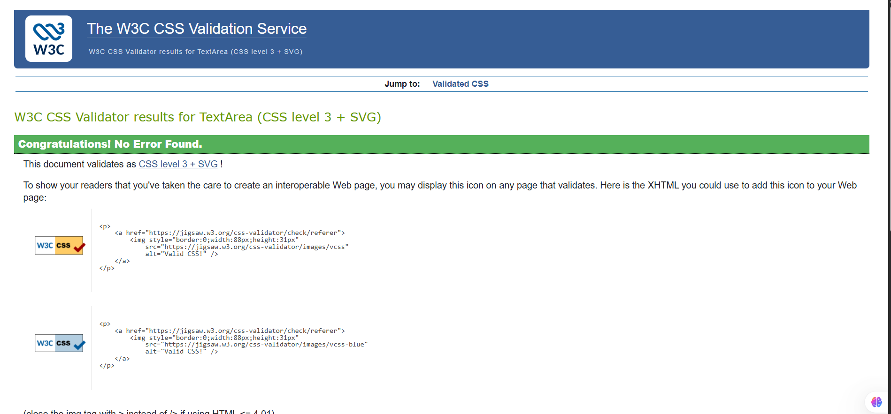

# 👨‍💼 Employee Management System

A responsive web-based Employee Management System developed using **HTML, CSS, and JavaScript**. 
This application allows users to register employees, display employee records in a table, and delete employee details dynamically through a simple and user-friendly interface.


# 📌 Project Overview

The Employee Management System is designed to manage employee information efficiently. It demonstrates the use of HTML for structure, CSS for styling and responsiveness, and JavaScript for dynamic functionality such as adding and deleting employee records.
---

# 🚀 Technologies Used

- HTML5
- CSS3
- JavaScript (ES6)
- Visual Studio Code
- Git & GitHub

---

# ✨ Features

- Employee Registration Form
- Auto-generated Employee ID
- Display Employee Records
- Delete Employee Record
- Responsive Design (Desktop, Tablet & Mobile)
- - 🌙 Dark / Light Mode Toggle
- HTML & CSS Validated using W3C Validator
- Simple and Clean User Interface

---

# 📂 Folder Structure

```
Employee-Management-System/
│
├── index.html
├── style.css
├── script.js
├── README.md
│
└── images/
    ├── header.png
    ├── Employee-registration.png
    ├── search-employee.png
    ├── empployee-list.png
    ├── Desktop-responsive.png
    ├── mobile-responsive.png
    ├── mobile-responsive-1.png
    ├── moblie-responsive-2.png
    ├── footer.png
    ├── Validate-HTML-W3C.png
    ├── Validate-CSS-W3C.png
    ├── light-Mode.png
    └── dark-Mode.png

```

---

# ⚙️ Installation & Setup

### Clone the repository

```bash
git clone https://github.com/rakhimittal09/Employee-Management-System.git
```

### Open the project

```text
Open the project folder in Visual Studio Code.
```

### Run the project

Open **index.html** in your browser

OR

Use **Live Server** extension in Visual Studio Code.

---

# 📸 Screenshots

## Header


---

## Employee Registration



---

## Search Employee



---

## Employee List



---

## Desktop Responsive View



---
## Dark Mode


----
## Light Mode



## Mobile Responsive View







---


## Footer


---

## HTML Validation (W3C)


---

## CSS Validation (W3C)



---

## 🔮 Future Improvements

- Edit Employee Details
- Search Employee by Name
- Filter Employees by Department
- Store Data in Local Storage
- Login & Authentication
- Backend Integration using Node.js, Express.js & MongoDB
- Export Employee Data to CSV/Excel

# 👩‍💻 Author

**Name:** Rakhi Mittal

**Course:** Advanced MERN Stack Internship

**GitHub:** https://github.com/rakhimittal09

---

# 📜 License

This project is created for educational and internship purposes only.

---

⭐ If you like this project, don't forget to star the repository!
